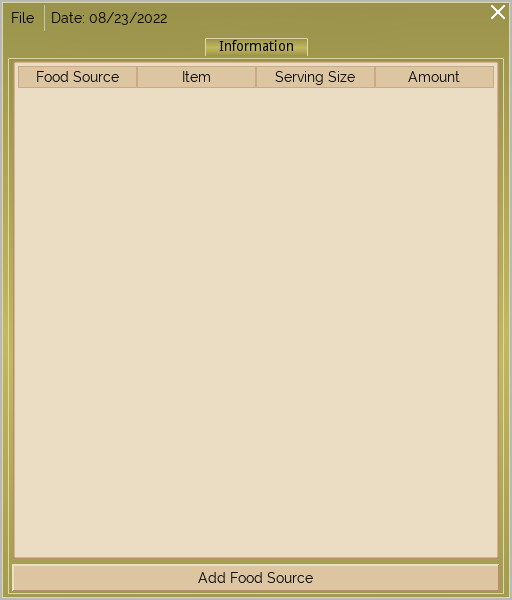
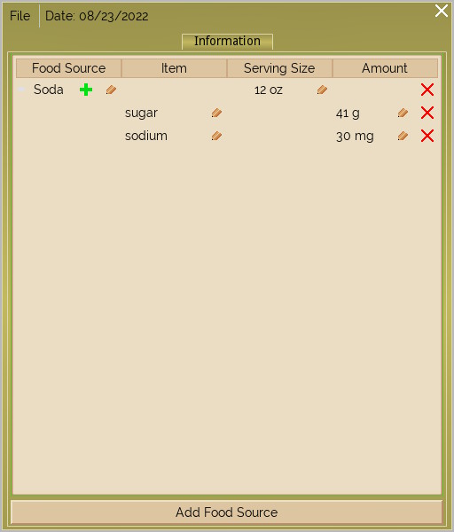
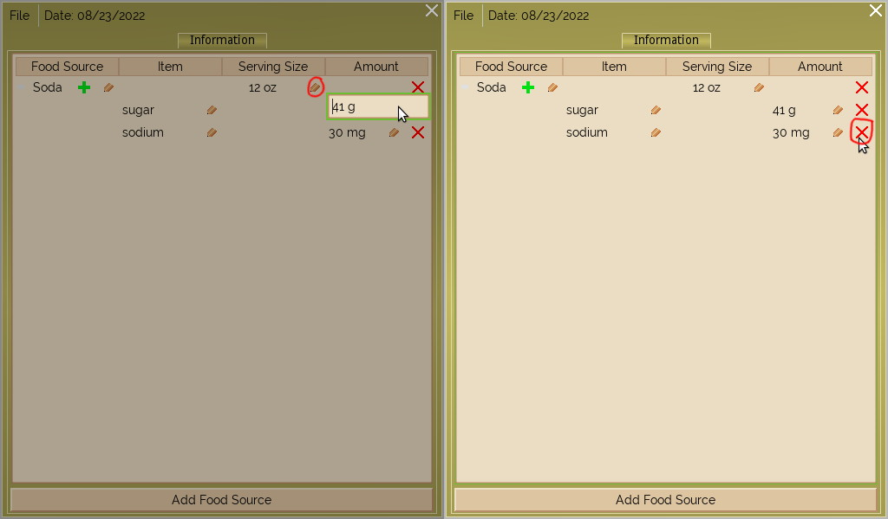
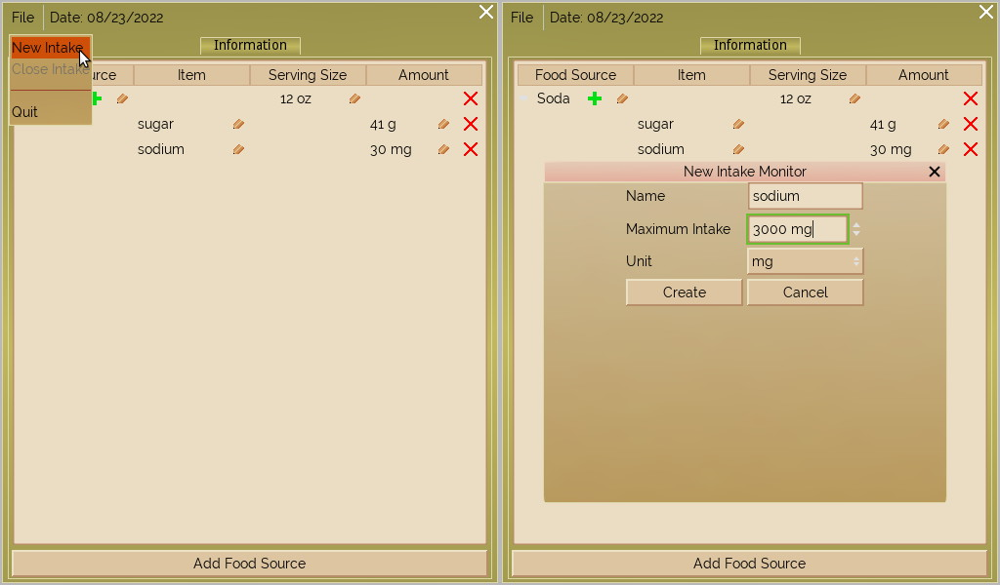
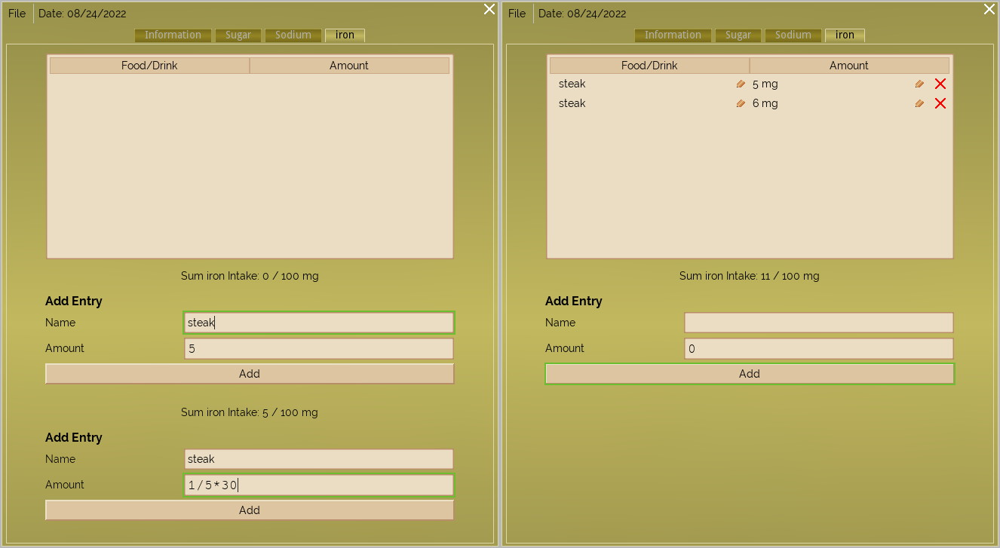

# Intake Monitor
The free and open source health-minded GUI application made in Godot.

This application is useful for those who want (or need) to track their daily intake
in things like sugar or sodium.

<!-- markdown-toc start - Don't edit this section. Run M-x markdown-toc-refresh-toc -->
**Table of Contents**

- [Intake Monitor](#intake-monitor)
    - [Definitions](#definitions)
- [Usage](#usage)
    - [Saving To A File](#saving-to-a-file)
    - [Creating An Intake Monitor](#creating-an-intake-monitor)
    - [Adding Intakes](#adding-intakes)

<!-- markdown-toc end -->

## Definitions
For this README to make sense, the following words are defined:

* Intake
    * Refers to things like sugar, sodium, or any other "nutrient" you may want to track.
* Intake monitor
    * Created through `File->New Intake` and closed with `File->Close Intake`. It is there that you
	  can input the amount of of a certain intake.
* Food source
    * Refers to the toplevel entries under the information tab. Under it are the intakes and how
	  much of it there are per serving size.

# Usage
When you first run the application, a window like this will popup:

*Example 1*

This is the information tab. Here you can put in common foods that you eat, their
serving size, and the amount of intakes[&ast;] that they have. By clicking the "add food source"
button you can add what are called food sources[&ast;] to the information tab. (See *Example 2*)

Add intakes to the food source by clicking on the green plus sign beside the name. You can
also edit any entry by clicking on the button that looks like a pencil, or delete that
same entry by clicking on the red X. (See *Example 3*)

**Note:** Deleting a food source deletes all the intakes underneath it.

*Example 2*

*Example 3*

## Saving To A File
`Intake Monitor` saves to a single located in a platform-specific folder on your system (or in
local storage if using the HTML5 port). This file is saved every time you add, delete, or modify
food sources or intakes, or when you close intake monitors[&ast;]. But when you create a new
intake monitor the file is not saved, so keep that in mind.

## Creating An Intake Monitor
Intake monitors[&ast;] are created through a dialog; to summon it, click on `File->New Intake`.
Clicking on `File->Close Intake` will close the intake monitor you're currently looking at;
doing so deletes all the entries therein. The menu option for it is disabled while on the
information tab. Type in the name of the intake you want and then your maximum desired daily
amount. Once you are done click `Create` to instance the new intake monitor. (See *Example 4*)

*Example 4*

## Adding Intakes
An intake monitor keeps a table of of intakes and their amounts. The "add entry" section is where
you can add intakes to the table. Every intake must have a name and an amount. The amount entry
only accepts numbers (the unit is added automatically when the form is submitted). The amount
entry also allows for basic arithmetic (+-*/). (See *Example 5*)

You can edit the fields of an intake. The entry for editing the amount accepts numbers and
allows for basic arithmetic as well.

*Example 5*

- - -

<small>* Refer to the section [Definitions](#definitions) above.</small>

[&ast;]: #footnote-1
